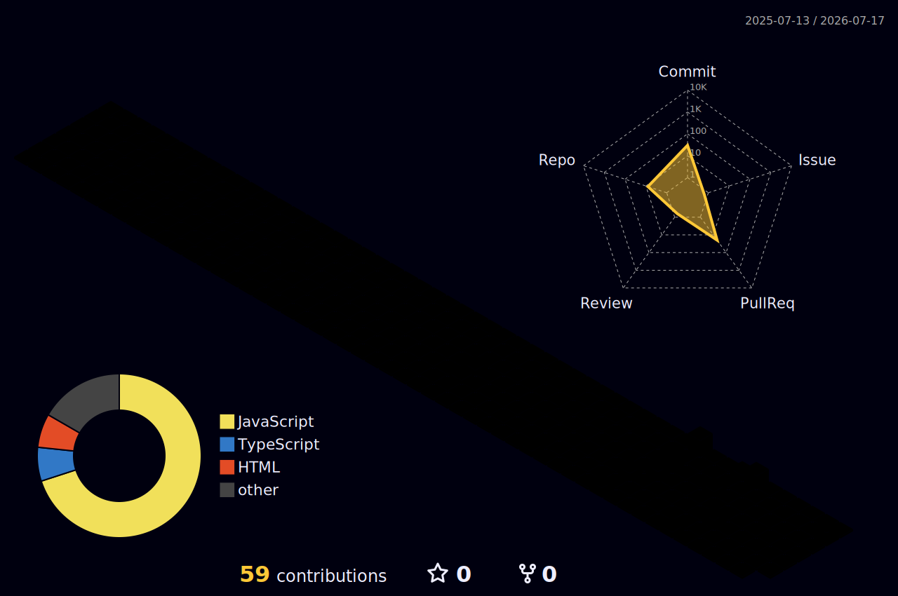

<!-- ===== ANIMATED HEADER ===== -->
<p align="center">
  
</p>

<!-- ===== TYPING ANIMATION ===== -->
<p align="center">
  <a href="https://github.com/karthick2004-git">
    
  </a>
</p>

<!-- ===== SOCIAL BADGES ===== -->
<p align="center">
  <a href="mailto:karthickhari851@gmail.com"></a>
  <a href="https://linkedin.com/in/YOUR-LINKEDIN"></a>
  <a href="https://github.com/karthick2004-git"></a>
  
</p>

---

## 👨‍💻 About Me

```javascript
const karthick = {
  location: "Madurai, Tamil Nadu, India",
  role: "React Native Developer @ Laabam One Business Solutions",
  code: ["JavaScript", "TypeScript"],
  stack: {
    mobile: ["React Native"],
    frontend: ["React.js", "HTML5", "CSS3", "Bootstrap"],
    backend: ["Node.js", "Express.js"],
    database: ["MongoDB"],
    tools: ["Git", "GitHub", "Postman", "VS Code"]
  },
  currentlyLearning: ["Next.js", "TypeScript"],
  funFact: "I turn requirements into working apps"
};
```

---

## 🛠️ Tech Stack

<p align="center">
  
</p>

---

## 🚀 Featured Projects

<table>
<tr>
<td width="50%" valign="top">

### 🚗 Rent Ride — Car Rental
Full-stack car rental app with listings, booking workflow & admin panel.

**Tech:** React · TypeScript · Node.js · Express

[Frontend »](https://github.com/karthick2004-git/rent-ride) · [Backend »](https://github.com/karthick2004-git/backend-rent-ride)

</td>
<td width="50%" valign="top">

### 🛒 E-Commerce Web App
Responsive online store with cart management & real-time pricing.

**Tech:** JavaScript · Node.js · Bootstrap

[Frontend »](https://github.com/karthick2004-git/mini-store) · [Backend »](https://github.com/karthick2004-git/ecommerceweb.backend)

</td>
</tr>
</table>

---

## 📊 GitHub Analytics

<p align="center">
  
  
</p>

<p align="center">
  
</p>

---

## 🧊 3D Contribution Graph

<p align="center">
  
</p>

---

## 🐍 Contribution Snake

<p align="center">
  
</p>

---

## 🏆 GitHub Trophies

<p align="center">
  
</p>

---

<p align="center">
  
</p>
